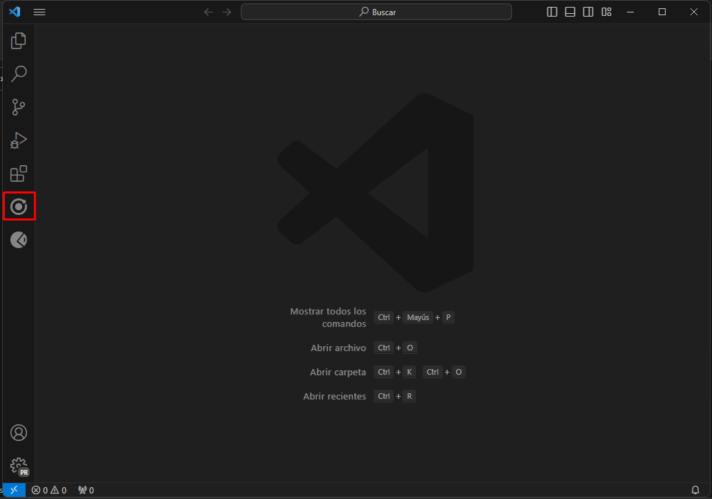

# Instalar Dependencias

## Paso 1: Instalar Node.js y npm

Si aún no tienes Node.js y npm instalados en tu sistema, debes hacerlo antes de poder utilizar npm. Puedes descargar la última versión de Node.js desde el [sitio web oficial de Node.js](https://nodejs.org/).

## Paso 2: Abrir consola de git dentro de la carpeta de nuestro proyecto

Para la instgalacion de nuestras dependencias debemos abrir en el explorador nuestro proyecto. <br />


## Paso 3: Abrir la Terminal

Abre la terminal o línea de comandos en tu sistema operativo. Asegúrate de estar en el directorio raíz de tu proyecto (donde se encuentra el archivo `package.json`, que es el archivo de configuración de npm). <br />


## Paso 4: Instalar Dependencias

Para instalar dependencias en tu proyecto, utiliza el siguiente comando en la terminal:

```bash
npm install
```


#Otra opción

## Paso 1: Abrir VScode

1. Para esta opcion requerimos que cargue toda la interfaz de Vscode, una vez cargada en la pagina de inicio buscaremos y seleccionaremos la opcion abrir carpeta.


1. Ingresar hasta la raíz de nuestro proyecto y presionar el boton de seleccionar carpeta


1. Esperar que cargue nuestro proytecto completo


4. Buscar el menú "Terminal" en la barra superior de VScode, abrirlo y señecciona la opción "Nuevo Terminal"


5. En la terminar tiliza el siguiente comando en la terminal:
    ```bash
    npm install
    ```
    

****
# Configurar URL para el consumo de API REST

En este paso asignaremos la URL que utilizamos para hacer el consumo en la API REST al momento de configurar el repositorio api_rest.

1. Buscar y abrir los archivos `Destinos.tsx` y `Municipios.tsx` en la ruta `src/pages`
2. Localizar la función `sendGetRequest`
3. localizar el parametro `url`
4. Colocar la URL que se utilizara para el consumo de la API REST

****
# Correr nuestra aplicación

Para ello utilizaremos la extencion de [Ionic](https://marketplace.visualstudio.com/items?itemName=ionic.ionic), que nos ayudara a poder vizualizar nuestra aplicacion en la web.

## Paso 1: Instalar la Extensión Ionic

Si aún no tienes Visual Studio Code instalado, puedes descargarlo desde el [sitio web oficial de VSCode](https://code.visualstudio.com/). Luego, sigue estos pasos para instalar la extensión "Ionic":

1. Abre Visual Studio Code.
2. Ve al menú "Extensions" (Extensiones) en la barra lateral izquierda o presiona `Ctrl+Shift+X`.
  <br />
3. En el campo de búsqueda, escribe "Ionic" y selecciona la extensión proporcionada por "Ionic" y asegurarnos que es del editor verificado.
  <br />
4. Haz clic en el botón "Install" (Instalar) para instalar la extensión.
  <br />

## Paso 2: Correr nuestra aplicación

En VSCode, ve al menú "Ionic" en la barra laterla izquierda. Sigue estos pasos:

1. Buscar la opción "Web" para lanzar nuestra aplicación a un navegador 
2. En el panel izquierdo nos mostrara un Qr (para vizualizarlo en un dispositivo movil) y se nos abrira la terminal en la seccion de salida, donde podremos ver las url a las cuale spodemos acceder para vizualizar nuestra aplicación: <br> 
3. Se abrira abrira el navegador web por defecto o abrira una pestaña.<br> 
4. Presionaremos la tecla `F12` para abrir el inspeccionador de elementos y daremos clic o presiona `Ctrl+Shift+M` para abrir la "Barra de herramientas del dispositivo"  <br> 
5. Vizualisaremos nuestra apliación como un dispositivo movil <br> 